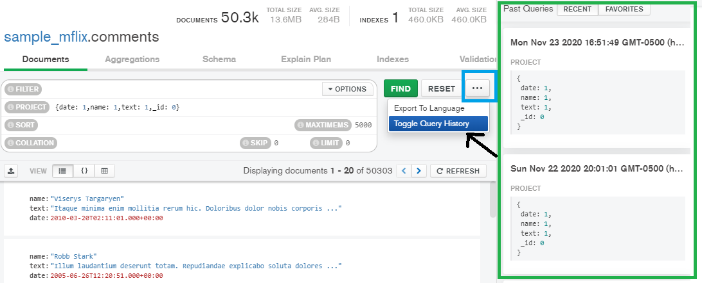
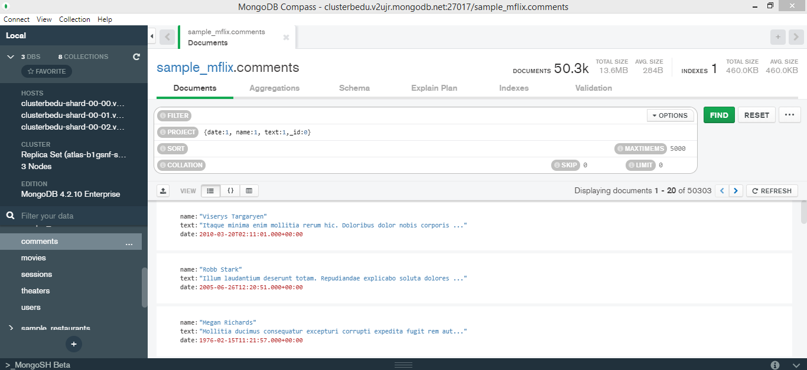
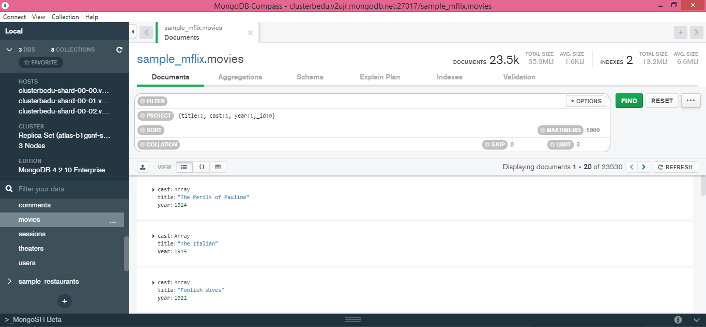
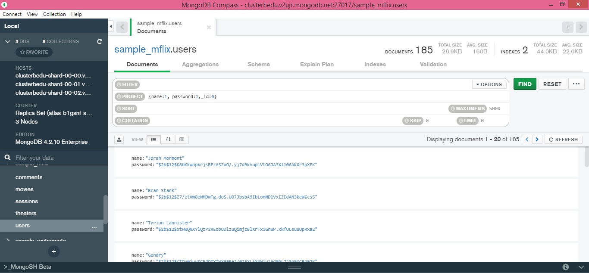
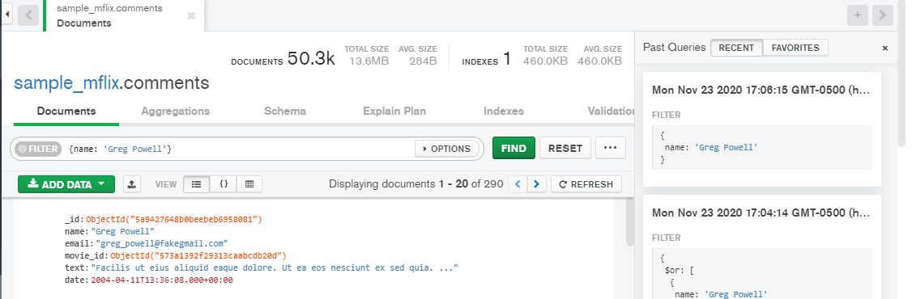
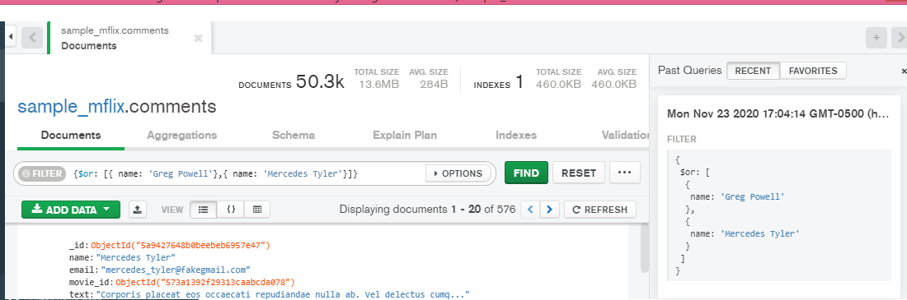
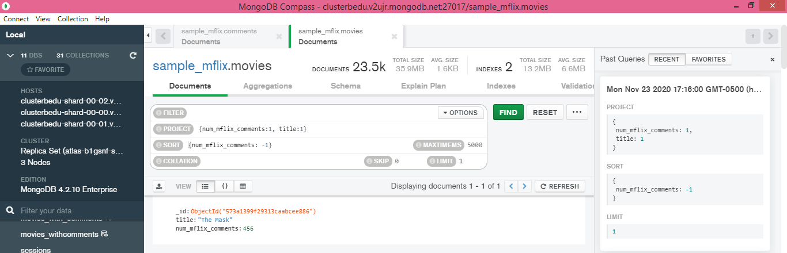
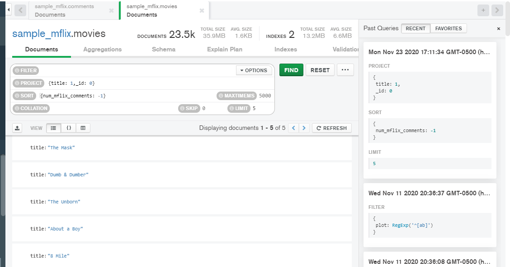

# Sesión4 BEDU: Fundamentos de MongoDB.
En esta sesión establecimos una conexión a la base de datos no relacional MongoDB la cual utiliza el **modelo orientado a documentos**.Además de esto algunas de sus características son:
- Documentos de esquema libre.
- Las colecciones contienen documentos.
- Más localidad por lo que son necesarios menos JOIN. 
- Sin embargo se tiene más redundancia y por tanto más desnormalización.
- Con ello la lectura de datos es más rápida pero la agregación de datos se alenta.

En esta caso, las BD orientadas a documentos siguen el formato JSON y BSON utilizando el modelo **llave-valor** equivalente al valor de una columna de una BD relacional.
Mongo DB Compass hace uso de la orientación llave-valor e utiliza BSON (JSON como compilador).

De tal forma que podemos hacer las siguientes relaciones entre conceptos de MySQL y MongoDB:
- Tabla -> Colección.
- Registro -> Documento.
- Columna -> Llave.

Algunos conceptos útiles serán:
- **Objeto:** Conjuntos desordenados de pares *llave-valor* que inician con { y terminan con }.
- **Valores:** Cadenas, números, booleanos, null, objetos o arreglos que se pueden anidar.
- **Arreglos:** Colección de valores que se encuentran entre [ ] y se separan con ,.

Para utilizar **Mongo DB Compass** se realizó la creación de un **Cluster** en MongoDB Atlas utilizando como Cloud provider: AWS y EU como región. Una vez creado dicho cluster, se cargó una BD de prueba y se realizó la conexión en MongoDB Compass.

### :exclamation: NOTA:  Para generar las evidencias de los retos es necesario hacer click en `...` y posteriormente en `Toogle Query History`para generar el documento .json en el cual se encontran las consultas realizadas.

En esta sesión los retos fueron:
### :pushpin: Reto 1. Colecciones, Documentos y Proyecciones.
Usando la base de datos `sample_mflix`:

#### - Fecha, nombre y texto de cada comentario.
Para esto nos conectamos a *sample_mflix.comments* en la pestaña **Documents**. Utilizando **PROJECT** es posible escoger los datos a proyectar, en este caso date,name y text. Todo utilizando la forma ***llave-valor***.

   

#### - Título, elenco y año de cada película.
De la misma forma que el anterior se utiliza **PROJECT** pero esta vez en *sample_mflix.movies* proyectando title, cast y year.

   
#### - Nombre y contraseña de cada usuario.
Finalmente el uso de **PROJECT** en *sample_mflix.users* proyectando name y password.

   

### :pushpin: Reto 2. Filtros básicos.
Usando la base de datos `sample_mflix`:

Para los filtros se utiliza **FILTER** de la pestaña **Documents**
- ¿Qué comentarios ha hecho Greg Powell?
  
- ¿Qué comentarios han hecho Greg Powell o Mercedes Tyler?
 
- ¿Cuál es el máximo número de comentarios en una película?
 
- ¿Cuál es título de las cinco películas más comentadas?
 
